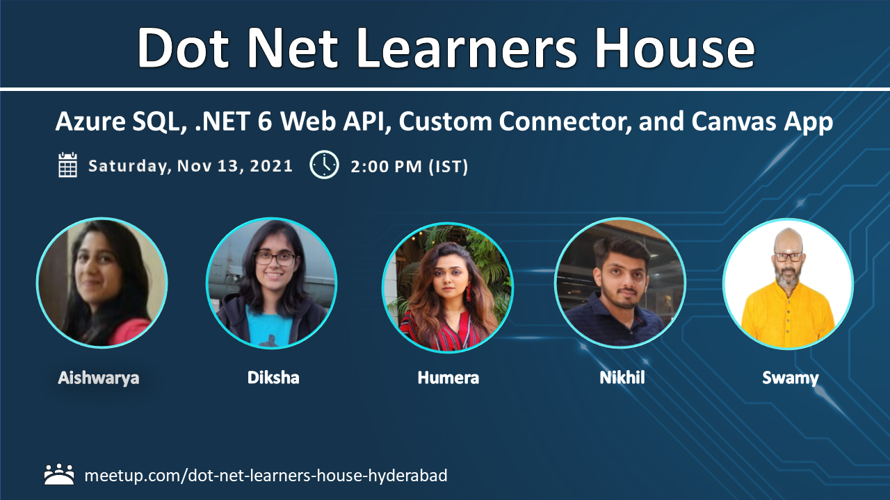
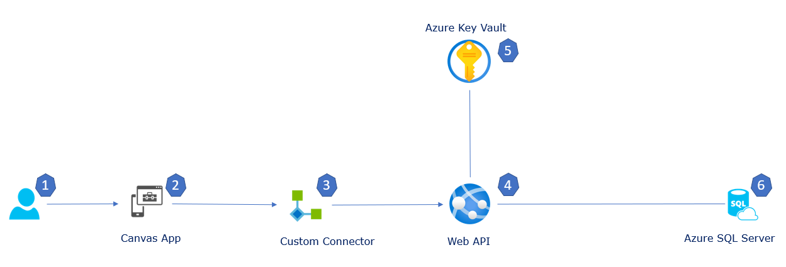
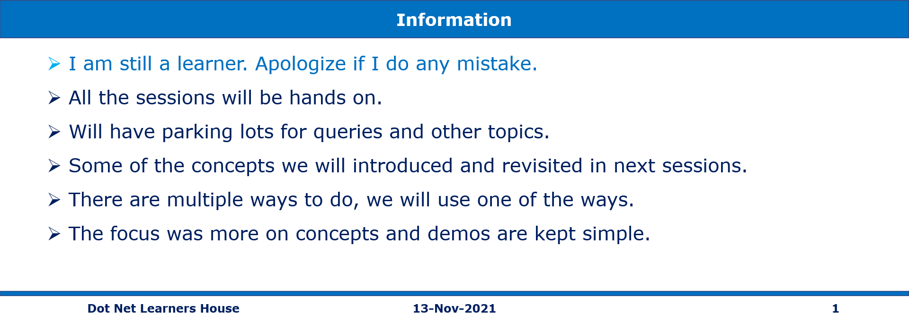

# Power of Azure SQL, .NET 6 Web API, Custom Connector, and Canvas App on 13-Nov-2021 at 02:00 PM IST

## Event URL: [https://www.meetup.com/dot-net-learners-house-hyderabad/events/281589261](https://www.meetup.com/dot-net-learners-house-hyderabad/events/281589261)

---

## Application Architecture Diagram

---

## Information

## What are we doing today?

> 1. Deploy SQLPROJ to Azure SQL
> 1. Deploy .NET 6 Web API to Azure App Service
> 1. Create Custom Connector in Power Apps use .NET 6 Web API, Currency Layer API
> 1. Create Canvas App and display the data from Custom connector Web API (.NET 6 Web API)
> 1. Create Canvas App and display the data from Custom connector (Curreny Layer API)
> 1. SUMMARY / RECAP / Q&A

---

## 1. Deploy SQLPROJ to Azure SQL

> 1. Discussion & Demo

## 2. Deploy .NET 6 Web API to Azure App Service

> 1. Discussion & Demo

## 3. Create Custom Connector in Power Apps use .NET 6 Web API, Currency Layer API

> 1. Discussion & Demo

## 4. Create Canvas App and display the data from Custom connector Web API (.NET 6 Web API)

> 1. Discussion & Demo

## 5. Create Canvas App and display the data from Custom connector (Curreny Layer API)

> 1. Discussion & Demo

## 6. SUMMARY / RECAP / Q&A

---

> 1. SUMMARY / RECAP / Q&A
> 2. Any open queries, I will get back through meetup chat/twitter.

---